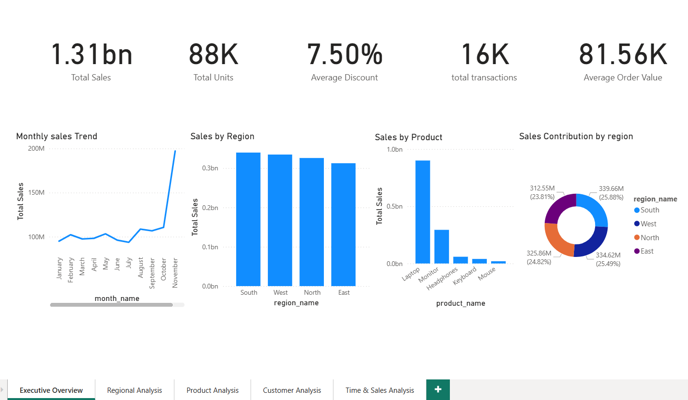
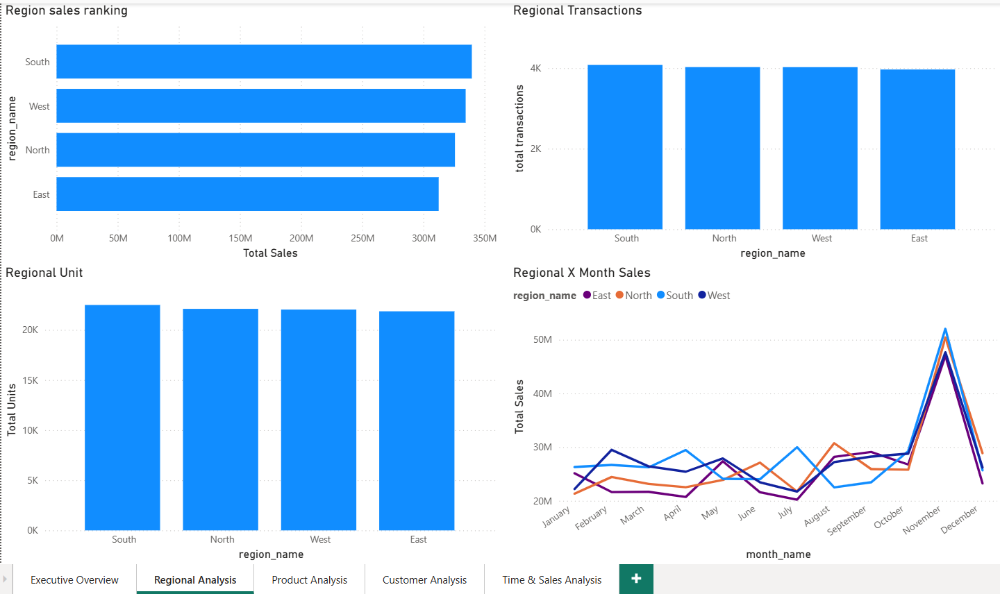
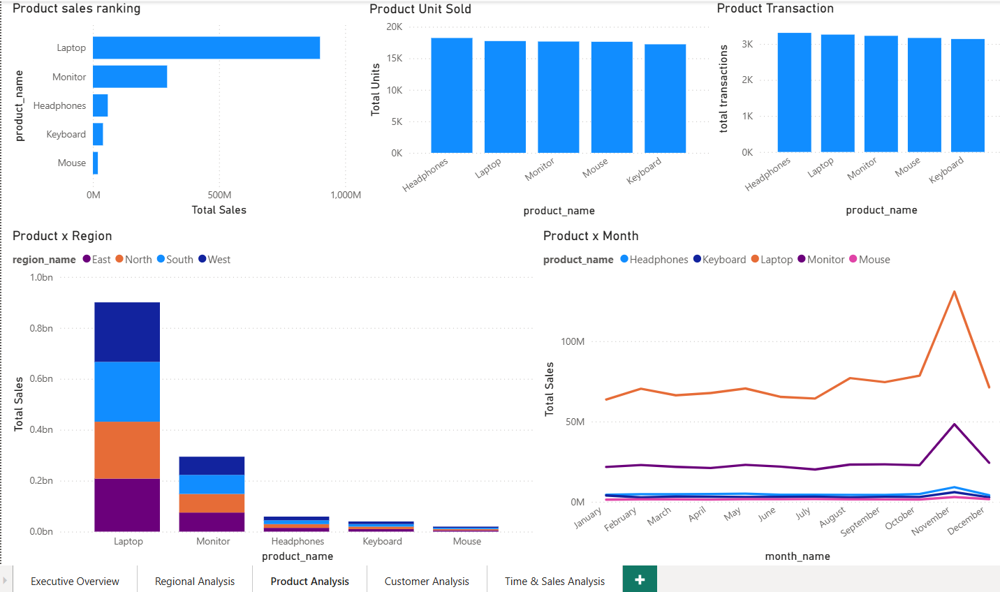
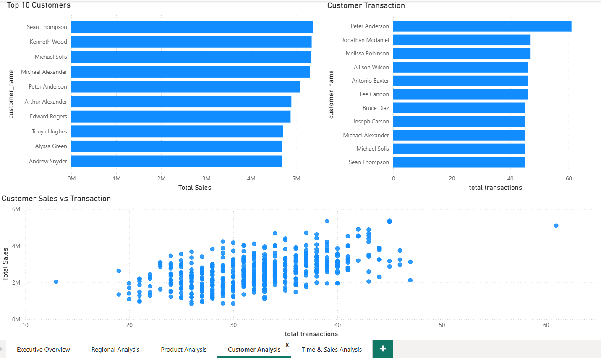
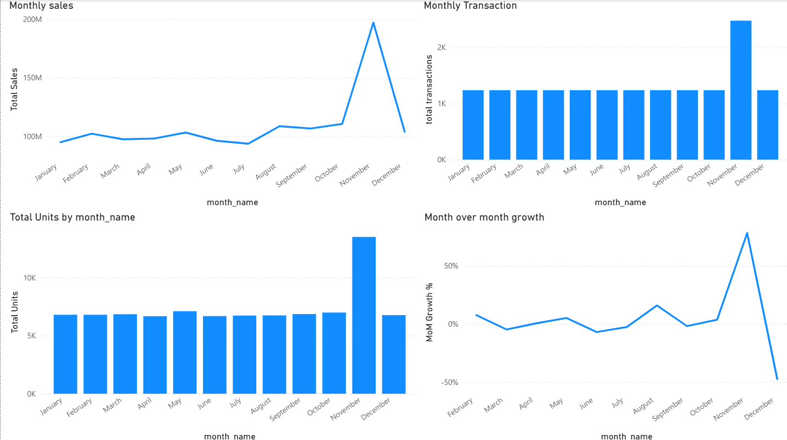
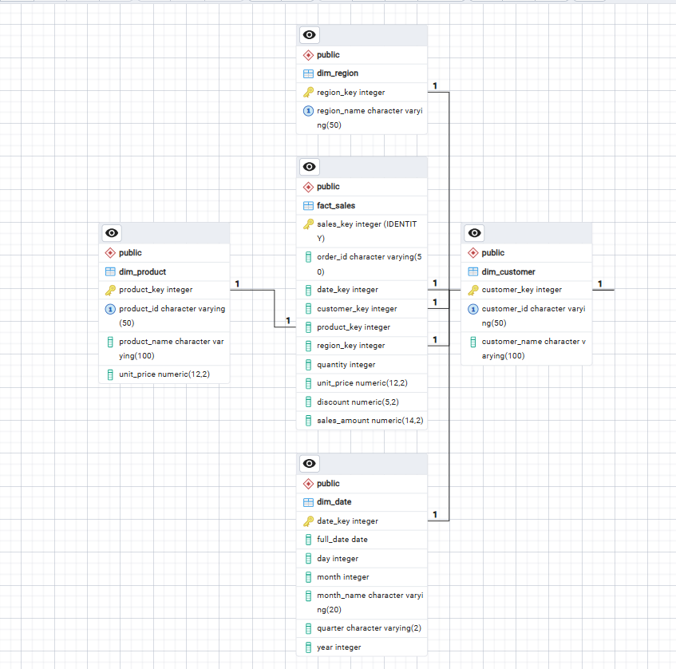
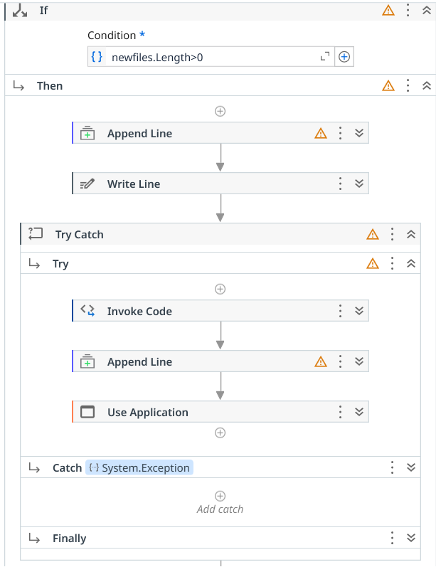
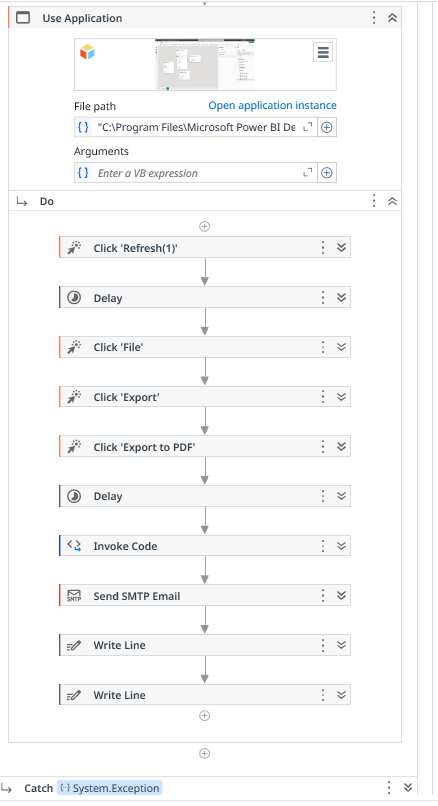

# Sales Analytics & Automation Platform 📊🤖

An end-to-end **Sales Analytics & Automation Platform** that transforms raw Excel sales files into structured data, business insights, interactive Power BI dashboards, and automatically distributed PDF reports.

**Excel → Python ETL → PostgreSQL → SQL Analytics → Power BI → UiPath → PDF → Email**

---

## 📌 Project Overview

The Sales Analytics & Automation Platform is an end-to-end data analytics and automation project designed to transform raw sales data into structured business insights and automated reports.

The project simulates a real-world sales reporting workflow where monthly sales data arrives as Excel files with data-quality challenges such as inconsistent column names, different date formats, missing values, blank rows, and duplicate records.

Python is used to validate, clean, standardize, transform, and load the data into PostgreSQL. The processed data is organized using a **star schema** and analyzed using SQL.

Power BI provides a five-page interactive dashboard, while UiPath automates the reporting process — from detecting new Excel files to running the ETL pipeline, refreshing Power BI, exporting the report to PDF, and sending the report by email.

---

## 🎯 Business Problem

Sales reporting can involve repetitive manual activities:

1. Receiving monthly Excel files
2. Checking and cleaning the data
3. Standardizing inconsistent formats
4. Loading data into a database
5. Running analytical queries
6. Refreshing dashboards
7. Generating reports
8. Sending reports to stakeholders

The goal of this project is to automate this workflow and create a repeatable process that can handle new sales files with minimal manual intervention.

---

## 💼 Business Use Cases

### Sales Performance
Analyze revenue, transaction volume, and sales trends over time.

### Regional Analysis
Compare sales performance across different regions.

### Product Analysis
Analyze product-level sales, quantity sold, and revenue contribution.

### Customer Analysis
Understand customer-level sales activity and contribution.

### Automated Reporting
Automatically generate and distribute an updated sales report when new input data is available.

### Data Quality
Detect invalid records, missing required values, inconsistent formats, and duplicate transactions during ETL processing.

---

# 🏗️ System Architecture

```text
┌─────────────────────┐
│   Excel Sales Files │
│       (.xlsx)       │
└──────────┬──────────┘
           │
           ▼
┌─────────────────────┐
│      Python ETL     │
│                     │
│ • File Detection    │
│ • Validation        │
│ • Cleaning          │
│ • Transformation    │
│ • Deduplication     │
└──────────┬──────────┘
           │
           ▼
┌─────────────────────┐
│     PostgreSQL      │
│                     │
│    Star Schema      │
│                     │
│ • fact_sales        │
│ • dim_customer      │
│ • dim_product       │
│ • dim_region        │
│ • dim_date          │
└──────────┬──────────┘
           │
           ▼
┌─────────────────────┐
│    SQL Analytics    │
│                     │
│ • Sales Analysis    │
│ • Region Analysis   │
│ • Product Analysis  │
│ • Customer Analysis │
│ • Time Analysis     │
└──────────┬──────────┘
           │
           ▼
┌─────────────────────┐
│      Power BI       │
│                     │
│ • Executive Overview│
│ • Regional Analysis │
│ • Product Analysis  │
│ • Customer Analysis │
│ • Time & Sales      │
└──────────┬──────────┘
           │
           ▼
┌─────────────────────┐
│       UiPath        │
│                     │
│ • Detect New Files  │
│ • Run Python ETL    │
│ • Refresh Power BI  │
│ • Export PDF        │
│ • Send Email        │
│ • Maintain Logs     │
└──────────┬──────────┘
           │
           ▼
┌─────────────────────┐
│ Automated PDF Email │
│       Report        │
└─────────────────────┘
```

---

# 🔄 End-to-End Workflow

### 1. Input Data
Monthly sales data is received as Excel files in `data/raw/`.

### 2. File Detection
UiPath checks the raw-data directory and compares incoming files against `data/processed_files.txt`. Only unprocessed files are selected.

### 3. Python ETL
Python performs Excel ingestion, column-name standardization, date handling, validation, transformation, dimension mapping, duplicate prevention, and fact loading.

### 4. PostgreSQL
Cleaned data is loaded into the `sales_analytics` PostgreSQL database.

### 5. SQL Analytics
SQL queries analyze overall sales, monthly trends, regional performance, product performance, customer activity, and transaction trends.

### 6. Power BI
Power BI connects to PostgreSQL and provides five dashboard pages.

### 7. UiPath Automation
UiPath orchestrates the complete workflow from new-file detection through ETL, Power BI refresh, PDF export, and email delivery.

### 8. Automated Distribution
The completed Power BI report is exported as a PDF and automatically attached to an email.

---

# ⭐ Database Design

The PostgreSQL database follows a **star schema**.

```text
                  ┌─────────────────┐
                  │  dim_customer   │
                  └────────┬────────┘
                           │
                           │
┌─────────────────┐        ▼        ┌─────────────────┐
│    dim_date     │────► fact_sales ◄────│  dim_product   │
└─────────────────┘        ▲        └─────────────────┘
                           │
                           │
                  ┌────────┴────────┐
                  │    dim_region   │
                  └─────────────────┘
```

## Fact Table

### `fact_sales`

Contains transaction-level sales data:

- `sales_key`
- `order_id`
- `date_key`
- `customer_key`
- `product_key`
- `region_key`
- `quantity`
- `unit_price`
- `discount`
- `sales_amount`

## Dimension Tables

### `dim_customer`
Stores customer information and the customer dimension key.

### `dim_product`
Stores product information and product attributes.

### `dim_region`
Stores region information.

### `dim_date`
Stores calendar information including full date, day, month, month name, quarter, and year.

---

# 📊 SQL Analytics

SQL is used to answer business questions and generate analytical outputs.

## Basic Sales Analysis

- Total sales
- Total transactions
- Monthly sales
- Average transaction value
- Sales trends

## Regional Analysis

- Sales by region
- Transactions by region
- Regional sales comparison

## Product Analysis

- Sales by product
- Quantity sold
- Product contribution
- Top-selling products

## Customer Analysis

- Customer sales contribution
- Customer transaction activity
- Customer-level performance

## Time Analysis

- Monthly sales trends
- Yearly analysis
- Time-based transaction analysis

---

# 📈 Power BI Dashboard

The Power BI report contains **five pages**.

### 1. Executive Overview
Provides a high-level view of overall sales performance and key KPIs.

### 2. Regional Analysis
Analyzes sales performance across regions.

### 3. Product Analysis
Provides product-level sales and performance insights.

### 4. Customer Analysis
Shows customer-level sales activity and contribution.

### 5. Time & Sales Analysis
Provides time-based sales trends and transaction analysis.

Power BI uses PostgreSQL as the data source and is refreshed by the UiPath workflow.

---

# 🤖 UiPath Automation

UiPath acts as the orchestration layer for the reporting process.

## Automation Flow

```text
Check Raw Folder
       ↓
Identify New Files
       ↓
Run Python ETL
       ↓
Refresh Power BI
       ↓
Export Report to PDF
       ↓
Wait for PDF Completion
       ↓
Copy Completed PDF
       ↓
Send Email
       ↓
Write Logs
```

## New File Detection
The automation compares Excel files in `data/raw` against `data/processed_files.txt`.

## Python ETL Execution
UiPath launches the project's Python virtual environment and executes the ETL pipeline.

## Power BI Automation
UiPath opens Power BI Desktop, refreshes the report, exports it to PDF, waits for the export to finish, and copies the completed PDF into `reports/`.

## Email Automation
The completed PDF is attached to an SMTP email and sent to the configured recipients.

---

# 🛡️ Data Quality & Error Handling

The project was designed to handle several real-world data and execution problems.

### Missing Customer ID
Rows with missing Customer IDs are identified as invalid during ETL processing.

### Missing Product ID
Rows with missing Product IDs are identified as invalid during ETL processing.

### Invalid Dates
Invalid or unparseable dates are detected and excluded from valid fact loading.

### Inconsistent Column Names
Different source column names are mapped to standardized internal names before processing.

### Duplicate Transactions
Duplicate fact records are prevented during database loading.

### Incremental Processing
Previously processed files are skipped using `processed_files.txt`.

### Database Failure
Database connection failures are surfaced by the ETL process, with transaction rollback used when an active database transaction exists.

### Power BI Failure
Power BI launch or automation failures are surfaced through UiPath.

### Logging
Execution information is stored in dedicated log files for monitoring and troubleshooting.

---

# 🧪 Testing & Validation

The completed automation was tested against multiple data-quality and system-failure scenarios.

| Test | Result |
|---|:---:|
| No new files | ✅ |
| Missing Customer ID | ✅ |
| Missing Product ID | ✅ |
| Invalid Date | ✅ |
| Database failure | ✅ |
| Power BI failure | ✅ |
| PDF export timing issue | ✅ Fixed |
| PDF email delivery | ✅ |
| Recovery after failure | ✅ |
| Logging verification | ✅ |
| Processed-file tracking | ✅ |
| Duplicate processing protection | ✅ |
| Fact-table duplicate validation | ✅ |

The final duplicate-integrity query returned **0 duplicate transaction groups** using the defined transaction fields.

---

# 📁 Project Structure

```text
Sales Analytics & Automation Platform/
│
├── data/
│   ├── raw/
│   ├── processed/
│   └── processed_files.txt
│
├── logs/
│   ├── automation_log.txt
│   └── python_etl_output.txt
│
├── reports/
│
├── src/
│   ├── generate_data.py
│   ├── validate_raw_data.py
│   ├── find_input_files.py
│   ├── load_dimensions.py
│   └── run_etl.py
│
├── UiPath/
│   └── SalesAnalyticsAutomation/
│       └── Main.xaml
│
├── .venv/
│
└── README.md
```

---

# 🛠️ Technology Stack

| Technology | Purpose |
|---|---|
| Python | Data generation, validation and ETL |
| Pandas | Data processing and transformation |
| Faker | Synthetic sales-data generation |
| PostgreSQL | Database and analytical data storage |
| SQL | Business and sales analytics |
| Excel | Source data |
| Power BI | Dashboard and visualization |
| UiPath | Workflow automation |
| SMTP | Automated email delivery |
| Git | Version control |

---

# ⚙️ Installation & Setup

## Prerequisites

Install:

- Python 3.x
- PostgreSQL
- Power BI Desktop
- UiPath Studio
- Microsoft Excel or compatible spreadsheet software

## 1. Clone the Project

```bash
git clone <your-repository-url>
cd "Sales Analytics & Automation Platform"
```

## 2. Create a Python Virtual Environment

```bash
python -m venv .venv
```

For Windows PowerShell:

```powershell
.\.venv\Scripts\Activate.ps1
```

## 3. Install Dependencies

```bash
pip install -r requirements.txt
```

## 4. Create PostgreSQL Database

```sql
CREATE DATABASE sales_analytics;
```

Create and populate the required dimension and fact tables according to the project database schema.

## 5. Run the ETL

```bash
python src/run_etl.py
```

## 6. Open Power BI

Open the Power BI report and refresh the PostgreSQL data source.

## 7. Run UiPath

Open `UiPath/SalesAnalyticsAutomation`, open `Main.xaml`, and run the workflow.

---

# 📤 Project Outputs

### PostgreSQL
Cleaned and structured sales data stored in the star schema.

### Power BI
Five-page interactive sales dashboard.

### PDF Report
Automated PDF version of the Power BI report.

### Email
Automated distribution of the generated PDF report.

### Logs
Execution and ETL logs stored in the `logs` directory.

---

# 📌 Key Project Outcomes

This project demonstrates practical experience with:

- End-to-end ETL development
- Data cleaning and validation
- Excel data processing
- PostgreSQL database design
- Star schema implementation
- SQL analytics
- Power BI dashboard development
- Incremental data processing
- Duplicate prevention
- UiPath workflow automation
- Automated PDF reporting
- Email automation
- Error handling
- Logging
- Failure recovery
- End-to-end testing

---

# 🚀 Future Enhancements

Potential improvements include:

- Scheduling the workflow through UiPath Orchestrator
- Replacing fixed PDF delays with file-readiness detection
- Adding automated ETL failure notifications
- Adding advanced customer segmentation
- Adding predictive sales analysis
- Adding automated data-quality reports
- Centralizing configuration and file paths
- Adding automated unit and integration tests
- Expanding the dashboard with additional KPIs

---

# 📊 Project Status

**Core implementation:** Completed ✅

**End-to-end integration:** Completed ✅

**Testing & error handling:** Completed ✅

**Documentation:** In progress 🚧

---

# 👩‍💻 Author

**Shruti Saxena**

---

## License

This project is intended as a personal portfolio and learning project.
# 📸 Project Screenshots

The following screenshots document the major components of the completed platform.

## Power BI Dashboard

### Executive Overview



### Regional Analysis



### Product Analysis



### Customer Analysis



### Time & Sales Analysis



## PostgreSQL Star Schema

The database uses a central `fact_sales` table connected to customer, product, region, and date dimensions.



## UiPath Automation

### File Detection & ETL

The workflow detects unprocessed files and triggers the Python ETL process.



### Reporting Automation

The workflow refreshes Power BI, exports the report to PDF, copies the completed report, sends the PDF through SMTP email, and writes execution logs.



---

# 📁 Project Structure

```text
Sales Analytics & Automation Platform/
├── README.md
├── .gitignore
├── requirements.txt
├── data/
├── docs/
│   └── screenshots/
│       ├── Executive_overview.png
│       ├── Product_analysis.png
│       ├── Regional_analysis.png
│       ├── Customer_analysis.png
│       ├── Time_Sales_analysis.png
│       ├── UiPath_file_detection_etl.png
│       ├── UiPath_reporting_workflow.png
│       └── Postgres_star_schema.png
├── logs/
├── reports/
├── src/
└── UiPath/
    └── SalesAnalyticsAutomation/
        └── Main.xaml
```

---

# 🛠️ Technology Stack

| Technology | Purpose |
|---|---|
| Python | Data generation, validation and ETL |
| Pandas | Data processing |
| OpenPyXL | Excel file handling |
| Faker | Synthetic data generation |
| PostgreSQL | Database storage |
| SQL | Business analytics |
| Power BI | Dashboard and visualization |
| UiPath | Workflow automation |
| SMTP | Automated email delivery |
| Git | Version control |

---

# 🧪 Testing & Validation

The platform was tested for:

- No-new-file handling
- Missing Customer IDs
- Missing Product IDs
- Invalid dates
- Database failure
- Power BI failure
- PDF export timing
- PDF email delivery
- Logging
- Processed-file tracking
- Duplicate processing protection
- Fact-table duplicate validation

The final duplicate-integrity check returned **0 duplicate transaction groups**.

---

# 📊 Project Status

| Area | Status |
|---|:---:|
| Data Generation | ✅ |
| PostgreSQL Database | ✅ |
| Python ETL | ✅ |
| SQL Analytics | ✅ |
| Power BI Dashboard | ✅ |
| UiPath Automation | ✅ |
| End-to-End Integration | ✅ |
| Testing & Error Handling | ✅ |
| Documentation | ✅ |

---

# 👩‍💻 Author

**Shruti Saxena**

---

## License

This project is intended as a personal portfolio and learning project.
